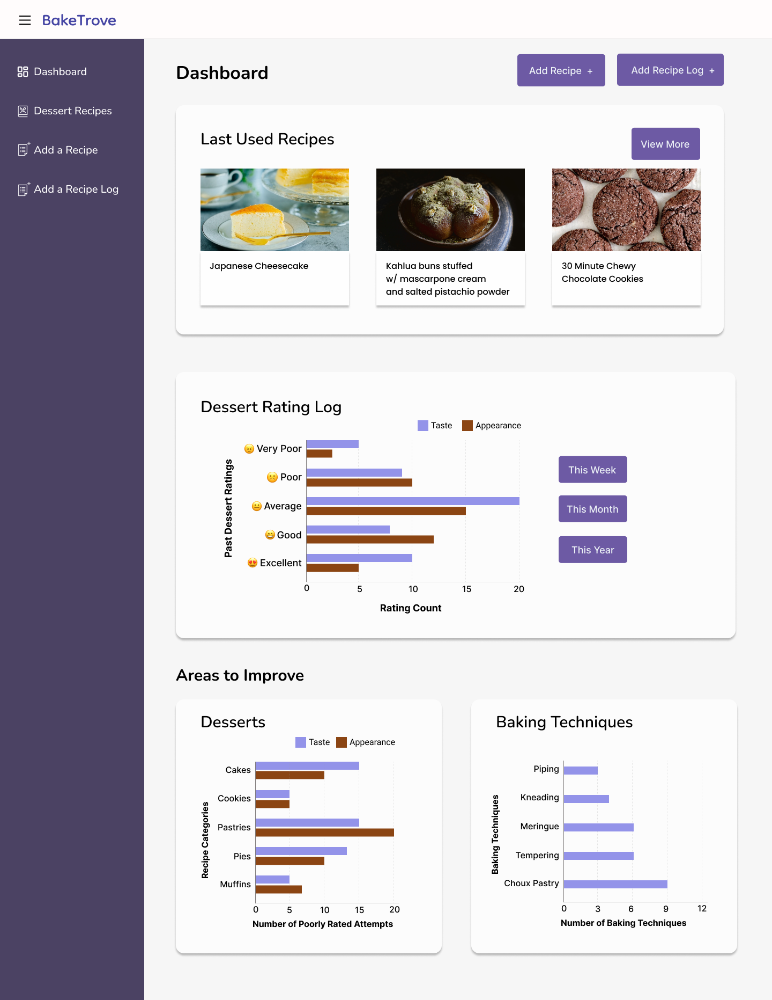

# BakeTrove - DECO2017 Web App Prototype

## Project Overview

BakeTrove is a single-page application (SPA), which is designed for hobby bakers and aspiring professional bakers who want to log their dessert recipes and track their baking attempts to act as a recipe organiser. This app was built using HTML, SCSS and vanilla JavaScript. It uses 'localStorage' for data storage and retrieval, and Node.JS with Express.JS for a simple web server. The project also uses Bootstrap and Jquery as CDNs to use Summernote, a simple WYSIWYG editor, enabling formatting of text. The Summernote JS library was useful for users to format recipe ingredients with an unordered list and the recipe steps with an ordered list. Furthermore, the FileReader API was used to enable image upload of dessert recipes.

## Version Control

This project uses Git and GitHub to track changes and to manage different changes in the code. Please see the GitHub repository here: <https://github.com/bethany1293/bpho4856-tracker>

## Features

- Add a recipe 

- Mobile responsive using media queries and flexbox

## Setup

1. Download Node.JS (if it is not already installed on your device)

2. Download the ZIP file called 'bpho4856-tracker' for this project.

3. Open the project folder in Visual Studio Code (VS Code), then type 'npm install' in the terminal of VS code to install all the necessary dependencies for this project

## Usage

1. Open the project folder in Visual Studio Code (VS Code).

2. In the in-built terminal of VS Code, type 'npm run dev' to start the server.

3. Copy the server link that is provided to you in the terminal e.g. http://localhost:1234.

4. Paste the server link into your preferred browser to access and use the web app.

Note1: Sometimes parcel throws an error, in which case '.parcel-cache' needs to be deleted.
Note2: The folder in '/assets/images-to-test-with' can be used to test the recipe image upload function when adding a recipe.

## Limitations

Local storage was used instead of a full database, so the web app was limited by having a maximum data storage limit. Also, as this web app is an minimum viable product (MVP), the range of functionalities is currently limited to only adding recipes, viewing recipes, and deleting recipes. In the future, more functionality that was previously planned, would be added to increase the scope of the web app to my previously targeted use case.

## Original High-Fidelity Wireframe - Plan

Originally the development

## Reflection

### Future Steps

## References List (APA 7th)

Adams, V. (n.d.). *Nunito*. <https://fonts.google.com/specimen/Nunito?query=Nunito>

Bell, A. (2019). *A Modern CSS Reset.* <https://dev.to/hankchizljaw/a-modern-css-reset-6p3>

Chen, N. (2023). *Japanese Cheesecake (Video) スフレチーズケーキ*. [Photo]. <https://www.justonecookbook.com/souffle-japanese-cheesecake/>

Clarkson, E. (2023). *30 minute Chewy Chocolate Cookies*. [Photo]. <https://cloudykitchen.com/blog/chocolate-cookies/>

Coyier, C. (2024). *A Complete Guide to Flexbox*. <https://css-tricks.com/snippets/css/a-guide-to-flexbox/>

Dongas, R. (n.d.). *Upload image to base64*. <https://codepen.io/robdongas/pen/dyggepJ>

Duckworth, E. (2022). *How To Make A Swiss Roll Cake*. <https://emmaduckworthbakes.com/how-to-make-a-swiss-roll-cake/>

[@Felix Jr]. (2018). *how to open multiple modal bootstrap with different id*. <https://stackoverflow.com/questions/53904558/how-to-open-multiple-modal-bootstrap-with-different-id>

Giraudel, K. (n.d.). *An opinionated styleguide for writing sane, maintainable and scalable Sass*. https://sass-guidelin.es/

Karin. (2016). *How to write variable with multiple css properties in Sass.* <https://stackoverflow.com/questions/38968129/how-to-write-variable-with-multiple-css-properties-in-sass>

[@mrkvon]. (2022). *@use not working in Sass to import variables but @import is working.* <https://stackoverflow.com/questions/73172387/use-not-working-in-sass-to-import-variables-but-import-is-working>

Nagi. (2023). *Crème Brûlée (French vanilla custard)*. <https://www.recipetineats.com/creme-brulee/>

Rambeck, N. (2017). *BEM by Example*. <https://sparkbox.com/foundry/bem_by_example>

Roffey, M. (2021). *A Complete Guide to Flexbox*. <https://www.sugarsaltmagic.com/custard-danish-pastry/>

Ryu, Y. (n.d.). *Dongle*. <https://fonts.google.com/specimen/Dongle?query=Dongle>

Sass Team. (n.d.). *Sass Basics*. <https://sass-lang.com/guide/#topic-6>

Summernote Team. (n.d.). *Getting Started*. <https://summernote.org/getting-started/>

[@underscore]. (2014). *Get the data-target dynamically*. <https://stackoverflow.com/questions/23590918/get-the-data-target-dynamically>

Web Dev Simplified Blog. (2023). *Modals Will Never Be The Same - HTML dialog Element*. <https://blog.webdevsimplified.com/2023-04/html-dialog/>